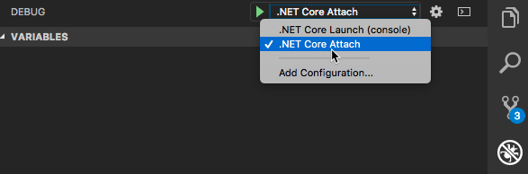
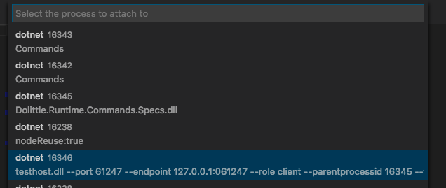
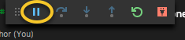
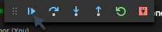

# DotNET.Build

Common build for all .NET Based projects.

## Setting up a new project

### Sub module

This project should be a Git sub-module of your project.

```shell
$ git submodule add https://github.com/dolittle-tools/DotNET.Build.git Build
```

### CSharp Project file

In order for the assembly name to be unique, add the following:

```xml
<PropertyGroup>
    <AssemblyName>Dolittle.{full name of package}</AssemblyName>
</PropertyGroup>
```

You can also import the default properties for a .NET Core project.

```xml
<Import Project="../../Build/MSBuild/default.props"></Import>
```

For specification projects you should use the `specs.props`

```xml
<Import Project="../../Build/MSBuild/specs.props"></Import>
```

## Visual Studio Code settings

In the `.vscode` folder there is a certain configuration set up that should enable you to get up and running pretty fast with things like building and running specifications, debugging and similar.
Since **Visual Studio Code** honors the settings in the `.vscode` folder local to your project you can easily create a symbolic link that points to this. The beauty about symbolic links is that they'll be part of the Git repository as well - meaning that everyone will have this benefit once it has been set up.

You create a symbolic link using the following:

```shell
$ ln -s /some/source/location /some/destination/location
```

Concretely this could be something like this:

```shell
$ ln -s ./Build/.vscode ./.vscode
```

This all depends on the location of things. For instance in projects with multiple projects within Source, you might have a different setup. You **MUST** use relative paths however.
It does however assume you have your `.vscode` folder on the level in which you're opening the workspace, as it will look for a `resolveProject.js` file to help it do the resolving of paths depending on the different tasks you give it.

### Visual Studio Code Tasks

In the `.vscode` folder sits a setup for different tasks that helps you get the most out of your development experience. You'll find `build`, `debug`, `restore` and `test` related tasks.
These tasks can quite easily be mapped to keyboard shortcuts, for instance like this (Press F1 -> "Preferences: Open Keyboard Shortcuts File"). In the keybindings.json you can then add the following to the array:

```json
[
    {
        "key": "shift+f6",
        "command": "workbench.action.tasks.runTask",
        "args": "build current"
    },
    {
        "key": "cmd+alt+f5",
        "command": "workbench.action.tasks.runTask",
        "args": "test debug"
    },
    {
        "key": "ctrl+shift+f5",
        "command": "workbench.action.tasks.runTask",
        "args": "tests no dependencies"
    },
    {
        "key": "cmd+alt+shift+f5",
        "command": "workbench.action.tasks.runTask",
        "args": "tests rerun"
    },
    {
        "key": "cmd+shift+r",
        "command": "workbench.action.tasks.runTask",
        "args": "restore"
    }
]
```

This gives you the following:

| Key-binding | Purpose |
| ----------- | ------- |
| shift+f6    | Build current project based on currently open file, locates closest .csproj file |
| cmd+alt+f5  | Runs tests for current project based on open file with debugger, debugger must be in attach mode and you can eventually attach it |
| ctrl+shift+f5 | Runs tests for current project based on open file without building dependencies |
| cmd+alt+shift+f5 | Reruns last testrun |
| cmd+shift+r | Restore packages for current project based on open file |

### Debugging tests

When debugging tests, make sure **Visual Studio Code** is configured to attach to processes



Go and set your breakpoints in specs or systems.
For starting debugging, use the `test debug` task (cmd+alt+f6 with the keybindings above, you'll get in the terminal the process Id of the process to
attach to:

```shell
Starting test execution, please wait...
Host debugging is enabled. Please attach debugger to testhost process to continue.
Process Id: 16408, Name: dotnet
Waiting for debugger attach...
Process Id: 16408, Name: dotnet
```

Then you simply hit debug (F5 - with default keybindings) and you find the process in the list:



The debug toolbar should show up and it will be showing the pause button:



After a little while, this changes to a play-like button:



That means its ready to be continued, you can click the button or just press F5 to continue (with default keybindings).

## AppVeyor

AppVeyor is the main build service used for .NET projects. It is responsible for compiling, packaging and deployment of packages.

### Encrypted Strings

> [Encrypt strings](https://ci.appveyor.com/tools/encrypt)  
> [Blog Post on AppVeyor + NuGet/MyGet](https://andrewlock.net/publishing-your-first-nuget-package-with-appveyor-and-myget/)

### Notifications -> Microsoft Teams

WebHook
Method: `POST`
WebHook URL: `https://outlook.office.com/webhook/<token>/`

Content-Type header : `application/json`

```json
{
    "title": "AppVeyor Build {{#passed}}passed{{/passed}}{{#failed}}failed{{/failed}}",
    "summary": "Build {{projectName}} {{buildVersion}} {{status}}",
    "themeColor": "{{#passed}}00FF00{{/passed}}{{#failed}}FF0000{{/failed}}",
    "sections": [
        {
            "activityTitle": "{{commitAuthor}} on {{commitDate}} ( {{repositoryProvider}}/{{repositoryName}} )",
            "activityText": "[Build {{projectName}} {{buildVersion}} {{status}}]({{buildUrl}})"
        },
        {
            "title": "Details",
            "facts": [
                {
                    "name": "Commit",
                    "value": "[{{commitId}} by {{commitAuthor}} on {{branch}} at {{commitDate}}]({{commitUrl}})"
                },
                {
                    "name": "Message",
                    "value": "{{commitMessage}}"
                },
                {
                    "name": "Duration",
                    "value": "{{duration}} ({{started}} - {{finished}})"
                }
            ]
        }
    ]
}
```
## Debug into Dolittle locally 

So you want to debug into Dolittle source code locally? Luckily for you, you can do just that (hopefully)!

What actually happens?:
1. The DeployPackagesLocally.sh script will build the dotnet solution located at %PWD% 
2. Create .nupkg files with a high version number in the %PWD%/Packages folder (it creates the folder if necessary). The content of the folder is deleted before new .nupkg files are created
3. The script will then go through each .nupkg file, delete the content of the place where the new .nupkg file will appear in %HOME%/.nuget/packages and then move the file over to that location and unpacking it.

For this to be successful, you **need** to follow these steps. 

Prerequisites:
1. Make sure that you have a .nuget/packages folder in your root/HOME/~ directory
2. Make sure the Build sub-module is up to date (git submodule update --remote --merge)

Steps for deploying packages locally:
1. You want to make sure that when building and packing the solutions they use the locally generated packages (the ones the DeployPackagesLocally.sh script creates and copies into the right place in %HOME%/.nuget/packages). This means for the solution, you need to have a packageSource feed that points to %HOME%/.nuget/packages.
    * This can be achieved by, for example, having a 
     ```
     <add key="local" value="%HOME%/.nuget/packages"/>
     ``` 
     as a child of a packageSources tag in the configuration tag in the top-level Nuget.Config file

2. When in the parent directory of the solution you want to build (The folder where the Build folder is present) execute the following commands in this exact order:
    1. dotnet clean (just in case)
    2. nuget restore
    3. dotnet build
    4. Build/DeployPackagesLocally.sh

3. Make sure that the application that you want to debug also has a packageSource reference to %HOME%/.nuget/packages. Do a dotnet clean && nuget restore && dotnet restore to ensure that the solution is using the locally deployed packages.
    * Note that if you're having trouble with dependencies (assemblies not loading or similar errors at startup) then this might be the cause. Check the other dependencies if they have dependencies on each other and build and package them in the correct ordering.
4. Happy debugging!

# Issues and Contributing
To learn how to contribute please read our [contributing](https://dolittle.io/contributing/) guide.

File issues to our [Home](https://github.com/dolittle/Home/issues) repository.

